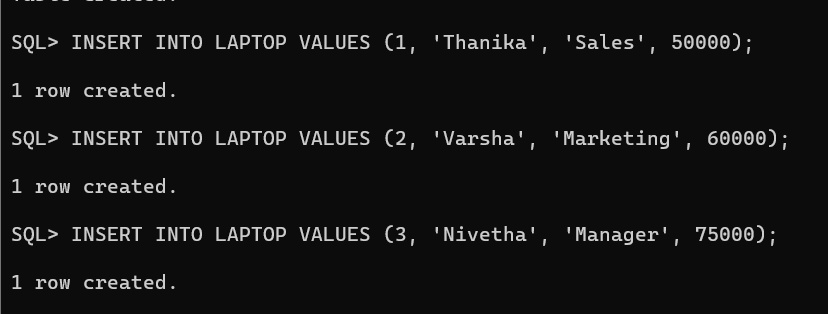
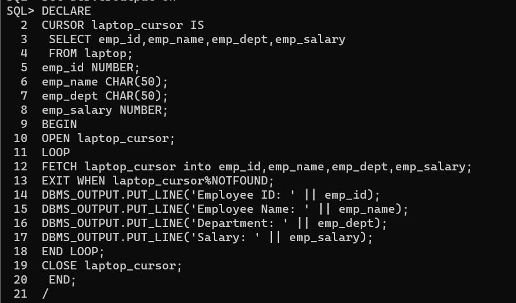
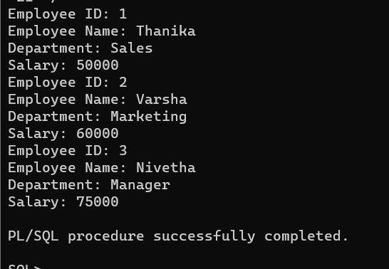

# Ex. No: 5 Creating Cursors using PL/SQL

### AIM: To create a cursor using PL/SQL.

### Steps:
1. Create employee table with following attributes (empid NUMBER, empname VARCHAR(10), dept VARCHAR(10),salary NUMBER);
2. Create a cursor named as employee_cursor
3. Using cursor read each record and display the result
4. Close the cursor

### Program:
### Create employee table
```
CREATE TABLE LAPTOP (emp_id number,emp_name char(20),emp_dept char(20),emp_salary number);
```
### Inserting the values:
```
INSERT INTO LAPTOP VALUES (1, 'Thanika', 'Sales', 50000);
INSERT INTO LAPTOP VALUES (2, 'Varsha', 'Marketing', 60000);
INSERT INTO LAPTOP VALUES (3, 'Nivetha', 'Manager', 75000);
```
### Declare a cursor:
```
DECLARE
CURSOR laptop_cursor IS
SELECT emp_id,emp_name,emp_dept,emp_salary
FROM laptop;
emp_id NUMBER;
emp_name CHAR(50);
emp_dept CHAR(50);
emp_salary NUMBER;
BEGIN
OPEN laptop_cursor;
```
### Fetch and display each record:
```
LOOP
FETCH laptop_cursor INTO emp_id, emp_name, emp_dept, emp_salary;
EXIT WHEN laptop_cursor%NOTFOUND;
```
### Display the result for each employee:
```
DBMS_OUTPUT.PUT_LINE('Employee ID: ' || emp_id);
DBMS_OUTPUT.PUT_LINE('Employee Name: ' || emp_name);
DBMS_OUTPUT.PUT_LINE('Department: ' || emp_dept);
DBMS_OUTPUT.PUT_LINE('Salary: ' || emp_salary);
END LOOP;
```
### Close the cursor:
```
CLOSE laptop_cursor;
END;
/
```

### Output:
## Create a table for employee:

## Inserting the values:

## Declare a cursor :

## Display the result:



### Result:
Creating a cursor using SQL/PL has been executed successfully..
